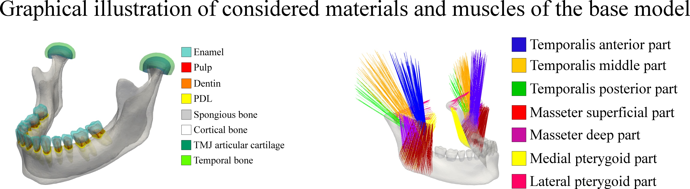

**Organization of files and folders**\
The files that describe model are stored in three folders:\
**bc**          - STL files with areas where boundardy conditions (Neumann and Dirichlet) need to be prescribed\
**bc_directed** - STL files needed for prescribing muscles (each muscle is defined with a pair of STL files, that corresponds to origin and insertion)\
**materials**   - composing materials of the mandible model (each STL file is a separate material)

