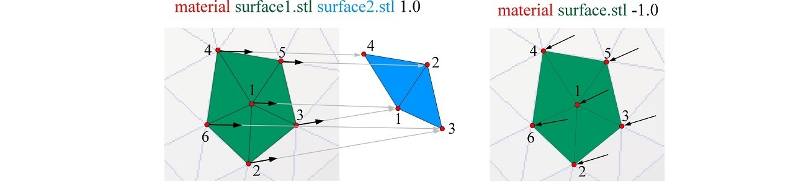

OpenMandible is  provided as both C++ source-code (folder "C++ source code") and executables (folder "Executables") that could be run on various operating sustem (Windows, Linux). 

Details on how to use them are provided in README files in the corresponding folders. Here, we provide an explaination of the config file and outputs - since they are common for both approaches of using the OpenMandible.

## Confguration file and format of OpenMandible commands

All instructions for generation of mandible models and BCs are contained in the config (open_mandible_program_parameters.cfg) file, which is split into six blocks/sections. In this file a user needs to set:\
 &ensp; &ensp; ●	Section A: Element type (supported types of elements are tet4/he8).\
 &ensp; &ensp; ●	Section B: The list of materials (from the folder input/materials) that will be discretised into volumetric meshes.\
 &ensp; &ensp; ●	Section C: The list of nodal and surface BCs (for prescribing scalars and vectors that act perpendicularly to the selected surface).\
 &ensp; &ensp; ●	Section D: The list of directed nodal BCs (used for defining muscles).\
 &ensp; &ensp; ●	Section E: Cortical bone orthotropy settings.\
 &ensp; &ensp; ●	Section F: Output file-formats (supported are *.txt, *.pos and *.vtk).

For sections C and D, the adopted command format is: “material filename1.stl filename2.stl intensity” (Figure). The string “material” determines the material on which BC need to be applied (i.e. cortical bone, or enamel); “filename1.stl” points on the STL file with nodes/faces that need to be selected from the material; the third string “filename2.stl” points to the STL file that contains a surface/nodes that should be used for computing the direction of prescribed loads. The final (fourth) parameter determines the direction and intensity of the prescribed loads (i.e. 1 outward and -1 indicates direction outwards, but any decimal number can be used for defining vectors’ magnitudes).

Sketch of the OpenMandible commands for prescribing BCs. The green surface is the input *.stl file that defines the model surface where BCs should be specified. Blue surface is the input *.stl file used for determining directions of prescribed vectors. a) format of commands for prescribing directed BCs (i.e. muscles, forces, springs); b) format of commands for prescribing BCs on/normal to surfaces (i.e. constraints, pressure, forces).

## Output folder
List of  nodes and elements of the generated model are written in files:\
**plain-text-elems** (.vtk and .pos are available for visualisation)\
**plain-text-nodes-tet** (.vtk and .pos are available for visualisation)

Moreover, there are three folders:\
**bc**       - contains selected areas where boundardy conditions (Neumann and Dirichlet) were prescribed\
**contacts** - contains shared faces (interfaces) between various materials\
**osteon_normal_binormal**   - contains orientations of osteons local coordinate systems (tangent corresponds to the principal axes - direction of osteons)\
**ansys_import_materials** - contains STL files ready to be imported into the Ansys simulation package
