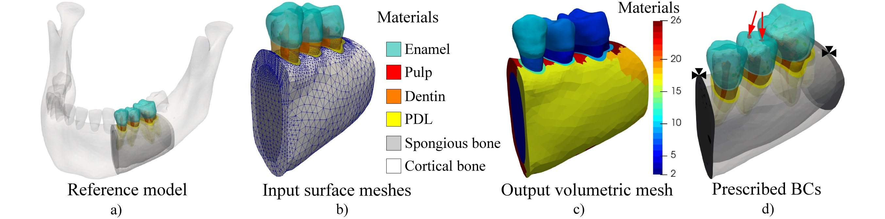
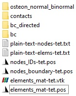
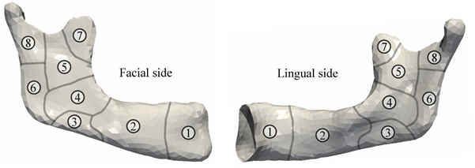
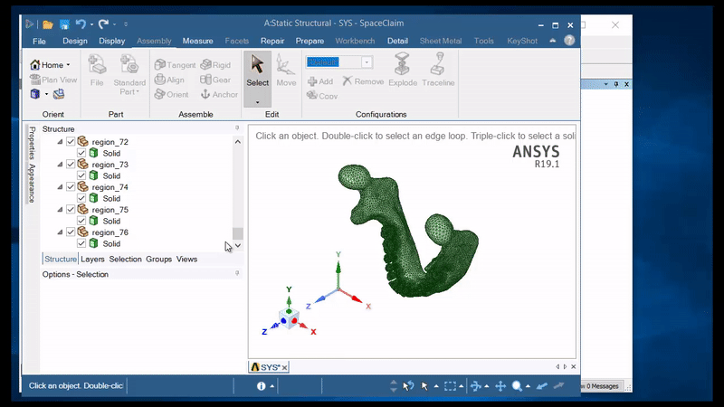
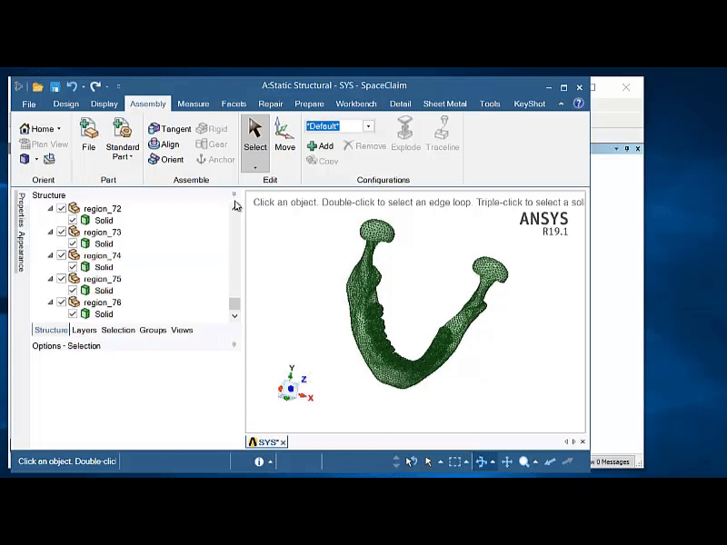
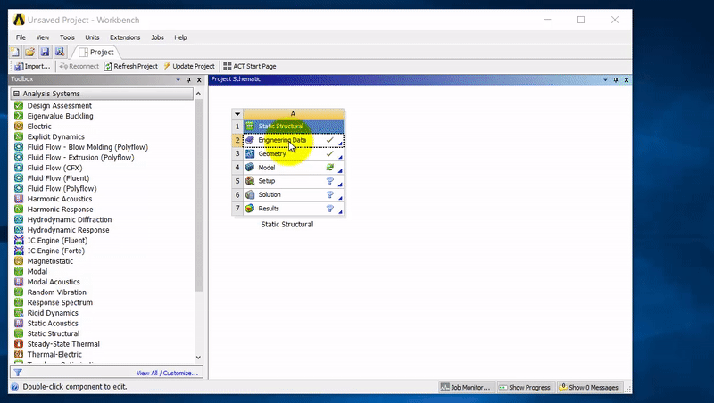
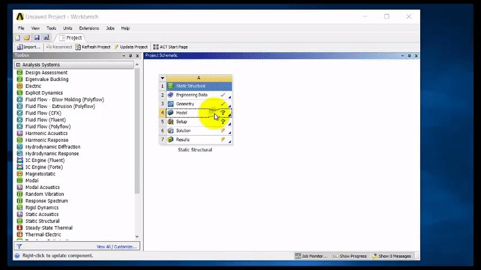
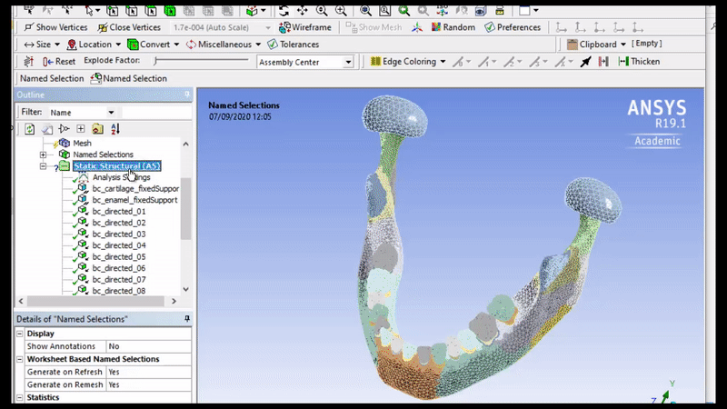
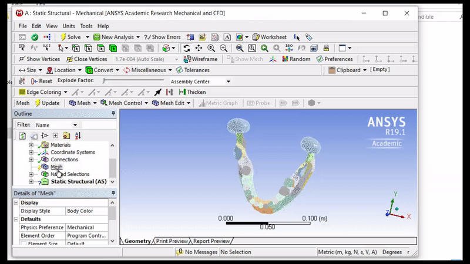

## Folders structure and resulting files
At the moment, we provide two use cases.\
**Use case 1** - the base model\
**Use case 2** - a cut model (obtained by modifying the base model)

Since output files are too large to be hosted on GitHub, we uploaded them on the Google drive and accessable on [the section Download developed sample models](#download-developed-sample-models).

## How to develop its model starting from the OpenMandible baseline model?

 
Development of a simplified model for studying a particular region of interest

Use case 2 was proposed to illustrate the OpenMandible workflow (Figure above). The intention was to analyse a single tooth (lower left sec-ond premolar), i.e. during its restoration. 

**Agenda**

[**Step #1** – Prepare input meshers of composing materials](#step-1--prepare-input-meshers-of-composing-materials)\
[**Step #2** – Set type of mesh elements in the config file](#step-2--set-type-of-mesh-elements-in-the-config-file)\
[**Step #3** – Set names of composing materials in the config file](#step-3--set-names-of-composing-materials-in-the-config-file)\
[**Step #4** – Discretization of surface meshes](#step-4--discretization-of-surface-meshes)\
[**Step #5** – Set boundary conditions](#step-5--set-boundary-conditions)\
[**Step #6** – Set orthotropic material characteristics](#step-6--set-orthotropic-material-characteristics)\
[**Step #7** – Set output file format](#step-7--set-output-file-format)\
[**Step #8** – Run the OpenMandible executable](#step-8--run-the-openmandible-executable)

#### **Step #1** – Prepare input meshers of composing materials

The first step is to adapt (cut) the reference mandible model in Figure-a. The remaining holes of the cortical and cancellous bone were patched - as shown in Figure-b. 

#### **Step #2** – Set type of mesh elements in the config file

After the surface meshes are ready, the type of elements (tet4 or hex8) was selected in the Section A of the config file.

    # Section A: Element type (supported are tet4/he8); 
    # 1 is tetrahedron, 8 is hexahedron
    Section_A_choice 1

#### **Step #3** – Set names of composing materials in the config file

Newly generated meshes, with the three teeth of interest were stored in the input folder “../input/materials/stl”, and their names and types were listed into the Section B of the../input/open_mandible_program_parameters.cfg file (config file). 

    Section_B_list_start
    -
    CancellousBone CancellousBone_LinearElastic 
    CorticalBone CorticalBone_Orthrotroptic
    Tooth_L4_Dentin Dentin_LinearElastic             
    Tooth_L4_Enamel Enamel_LinearElastic
    Tooth_L4_PDL PDL_Viscoelastic  
    Tooth_L4_Pulp Pulp_LinearElastic 
    Tooth_L5_Dentin Dentin_LinearElastic            
    Tooth_L5_Enamel Enamel_LinearElastic
    Tooth_L5_PDL PDL_Viscoelastic  
    Tooth_L5_Pulp Pulp_LinearElastic 
    Tooth_L6_Dentin Dentin_LinearElastic            
    Tooth_L6_Enamel Enamel_LinearElastic
    Tooth_L6_PDL PDL_Viscoelastic  
    Tooth_L6_Pulp Pulp_LinearElastic 
    -
    Section_B_list_end

#### **Step #4** – Discretization of surface meshes 

After that, the input surface meshes need to be discretised into volumetric; In this study, we used the TetGen mesh generator (http://wias-berlin.de/software/tetgen), which outputs (.node and .ele files) are placed in “../input/materials/tetgen-files” and used to assemble the model. 

Since the surface nodes of the neighbouring materials must be the same, it is necessary to generate a volumetric mesh without adding the new nodes to the surfaces of materials (with TetGen, -Y flag and -q10.0 should be used to control the mesh quality). To ease this task, we provide scripts for automatic meshing/processing of all STL files that are stored in the "input/materials/stl" folder.  

Windows users only need to double-click on the "batch_file_for_running_tetgen_on_Windows64.bat" file, which will execute following batch commands:

    @echo off
    del tetgen-files\*.*
    rmdir tetgen-files
    mkdir tetgen-files
    COPY  stl\*.* tetgen-files
    COPY  tetgen_win64.exe tetgen-files
    cd tetgen-files
    for %%f in (*.stl) do (tetgen_win64.exe -Y -q10.0 %%f)
    DEL  *.edge
    DEL  *.smesh
    DEL  *.face
    DEL  *.stl
    DEL tetgen_win64.exe
    cd ..

While linux users need to run "bash_file_for_running_tetgen_on_Linux64.sh" in the bash, which will execute:

    #!/bin/bash
    rm -r tetgen-files/; 
    mkdir tetgen-files/; 
    cp stl/* tetgen-files/; 
    cp tetgen_linux64 tetgen-files/; 
    cd tetgen-files/; 
    for f in *; 
    do ./tetgen_linux64 -Y -q10.0 $f; 
    done; 
    rm *.edge; 
    rm *.smesh; 
    rm *.face; 
    rm *.stl; 
    rm tetgen_linux64; cd ..;

*Note: In the case that the compiled versions of tetgen (tetgen_linux64, tetgen_win64.exe) do not work on your PC, please download and compile it from http://wias-berlin.de/software/tetgen.*

For the 14 input surface meshes, the OpenMandible generated 19 materials ("input/materials/tetgen-files") by splitting the cut part of cortical bone into the six ana-tomical zones (following Figure-c). 

#### **Step #5** – Set boundary conditions 

Boundary conditions that need to be prescribed were stored in the folder “../input/bc”, and commands for their application on the generated volumetric model were written into the Section C of the config file:

    Section_C_list_start
    -
    CorticalBone BC_Cortical_CancellousBone_FixedSupport.stl 1.0
    CancellousBone BC_Cortical_CancellousBone_FixedSupport.stl 1.0
    Tooth_L5_Enamel BC_Tooth_L5_Enamel_Forces.stl -1.0
    -
    Section_C_list_end

As illustrated in Figure-d, these commands constraint the movement of cortical and spongy bone compartments on the cut-planes (black colour), and apply forces on the left second premolar (red arrows). Since this use case does not require modelling of muscle support - the Section D of the config file remained empty. 

#### **Step #6** – Set orthotropic material characteristics 

Orthotropic material characteristics for the cortical were prescribed in Section E by using the following command:

    Section_E_choice_run_module 1
    Section_E_pick_material_name CorticalBone

#### **Step #7** – Set output file format

Finally, depending on user’s preference, output formats can be selected in Section F (.txt, .pos, and .vtk are supported). In the case that you are Ansys user (and do not need none of these formats), you can reduce time of execution by setting all paramters in the section F to zero.

| D1 (tangents) | D2 (normals) |  D3 (binormals) | 
| --------------- | --------------- |--------------- |
|  |   |    | 

  Osteons orthotropic  axes (click on image too see it in higher quality) 

*Resulting 3D orientations of osteons shown bellow, which indicate the high quality and uniformity of generated orthotopic axes - confirming the robustness to the modification of the cortical mesh. If we selected tet4 elements type, the output folder would contain a list of all: 1) nodes, 2) elements (with materials ID); 3) con-strained nodes; 4) surface where loads need to be applied.*

#### **Step #8** – Run the OpenMandible executable

The OpenMandible executable should be placed in the root folder - and executed after setting up the config file and the mentioned input files. 

By default, we provide OpenMandible executables for Linux64 ("OpenMandible_Linux64_Executable") and Windows64 ("OpenMandible_Windows64_Executable.exe" - double-click to run it).

*Note: In the case that the compiled versions of OpenMandible do not work on your PC, please download and compile the source-code with your compiler (we recommend to use the makefile C++ compiler).*

## How to import generated model into the Ansys (commercial simulation package)

Model data explained above need to be further imported into a simulation software. Since the Ansys package has been widely used in the related studies - we incorporated an automatic extraction of model geometry for it. Accordingly, the purpose of this guide is to show users how to import OpenMandible model (output files) into the Ansys package and run a simulation. 

**Agenda**

[**Step #1** – Download sample model or develop a new model](#step-1--download-sample-model-or-develop-a-new-model)\
[**Step #2** – Import geometry files and develop solid parts](#step-2--import-geometry-files-and-develop-solid-parts)\
[**Step #3** – Define material properties (Linear elastic, and Orthotropic)](#step-3--define-material-properties-linear-elastic-and-orthotropic)\
[**Step #4** – Assign material properties to generated solid parts](#step-4--assign-material-properties-to-generated-solid-parts)\
[**Step #5** – Define boundary conditions (named selections, constraints, muscle forces)](#step-5--define-boundary-conditions-named-selections-constraints-muscle-forces)\
[**Step #6** – Mesh the model and run simulation](#step-6--mesh-the-model-and-run-simulation)

#### **Step #1** – Download sample model or develop a new model

We remind that:
1)	Organization of input files is explained in https://github.com/ArsoVukicevic/OpenMandible/tree/master/00%20OpenMandible%20Base%20model
2)	Running the OpenMandible.exe and structure of the Output folder is explained in https://github.com/ArsoVukicevic/OpenMandible/tree/master/01%20OpenMandible%20Framework

For this particular example (Use case 1), due to the GitHub limitation of files size, output files are hosted on our google drive (links are available on the bottom of this page). To repeat this how-to, we suggest to download “output_base_model-tet” archive and extract it to your local drive. 

Regardless of the sample you run, the output folder structure should be: 

#### **Step #2** – Import geometry files and develop solid parts

Open the Ansys Workbench and import a static/transient structural analysis block, depending on the type of simulation you preffer to run.

The model geometry is stored in the STL files in the folder "ansys_import_materials" - which, beside all considered input materials, contains the cortical bone split into 16 anatomical zones:

We emphasize that, in this use case, we prescribed the orthrotropy per-zone (per-element orthrotropy should be prescribed by using data written in "osteon_normal_binormal" and more advanced Ansys scripting). 

Importing geometry of a particular file (i.e. "region 26") should be done by right-clicking on the "Edit Geometry in SpaceClaim...", and then importing the corresponding STL file as shown in:

After repeating these steps for each STL/material, the resulting Ansys project should look as:

Similarly, one can use OpenMandible outputs to define "Named selections", which will be further used to prescribe muscle foreces:

#### **Step #3** – Define material properties (Linear elastic, and Orthotropic)

Material properties of various tissues are given in Table 1 and Table 2 of our manuscript (*link to be added*).\
Before being able to assign them to  solid bodies created in the previous step - material properties/models need to be defined in the **Engineering data** Ansys module.\
To create new material property, go to **Instert -> New material** and chose type of material.\
In the following clip, we demonstrate how to create one elastic (enamel) material, since creating hyper-elastic (PDL) and orthotropic (Cortical bone) materials is very similar (and assume incporporating corresponding parameters): 

After repeating these steps for all consitutive materials, the resulting *Engineering data* table should have the following look:\

#### **Step #4** – Assign material properties to generated solid parts

Application of defined material properties should be done in the **Model** module (double-click). In the following video, we deomonstrate how to assing material characteristics to the the previously defined enamel solid part: 

Similarly, for each imported solid part (75 in total) material properties should be assinged. 

##### **Step #5** – Define boundary conditions (named selections, constraints, muscle forces)

In the OpenMandible, boundary conditions (BCs) are defind with the input STL files (folder "inputs/bc"). This eases their application in the Ansys by using **Named selection** feature. To demonstrate this task, we show how to create a named selection:

For prescribing muscle forces, users need to use data (X, Y and Z components) stored in .txt files written in the bc_directed folder. Vector intensities should be adopted from literature (see the Table 3 in the Manuscript). For the puropose of simplicity, in this use cases we showed how to prescribe averaged muscle vector per-area (while per-node vectors should be done by using more advanced Ansys scripting)

By repeating the procedure for each muscle, the project and model tree will have the following look. 

##### **Step #6** – Mesh the model and run simulation

After the model is developed, two remaining steps are to 1) discretize it to finite elements and 2) run simulation to compute it's physical response. 

## Download developed sample models

In this list, we provide generated outputs of two use-cases presented in this page.

##### **Use case 1** – Baseline model

OpenMandible outputs (tet4) - https://drive.google.com/file/d/1yAz7nyDQv1PAkLebnTZWMGGezXa9_Qbe/view

OpenMandible outputs (hex8) - https://drive.google.com/file/d/1Br4_XPwGabzDK5D4C-2-9h6kuR821ihH/view

Ansys project               - https://drive.google.com/file/d/1rbxYFufx-SfRjAbCmojh-99lWwOSu3ni/view

##### **Use case 2** – Cut model

OpenMandible outputs (tet4)  - https://drive.google.com/file/d/1P43zruAm4JD-zS0XubswwVggjeBaqNiU/view

OpenMandible outputs (hex8)  - https://drive.google.com/file/d/1RZkzR8EM5Gjyb-XKjthssWb9RuouBcx_/view

Ansys project                - https://drive.google.com/file/d/1_5D0NXfWX31AMblXxYEiCjTCe5mgaBww/view

