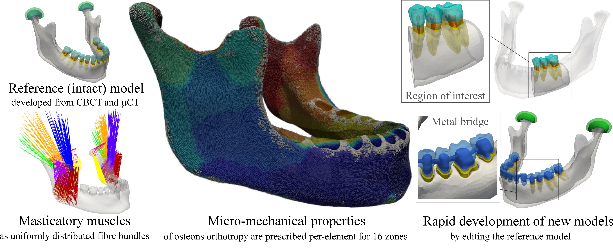
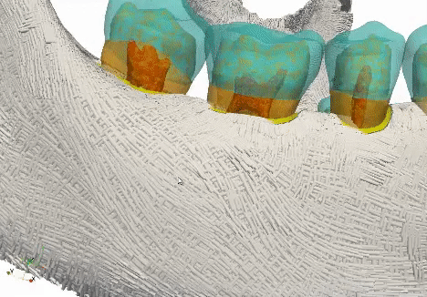

This repository is supplement to the study (https://doi.org/10.1016/j.dental.2021.01.009):

# OpenMandible: An open-source framework for highly realistic numerical modelling of lower mandible physiology 

 
Arso M. Vukicevic*,1, Ksenija Zelic2, Danko Milasinovic3,  Ali Sarrami‐Foroushani4, Gordana Jovicic1,   
Petar Milovanovic2, Marija Djuric2, Nenad Filipovic1, Alejandro F. Frangi4,5 

 
1 Faculty of engineering, University of Kragujevac, Kragujevac, Serbia  
2 Laboratory for Anthropology, Institute of Anatomy, School of Medicine, University of Belgrade, Belgrade, Serbia  
3 Faculty of Hotel Management and Tourism in Vrnjačka Banja, University of Kragujevac  
4 Centre for Computational Imaging and Simulation Technologies in Biomedicine (CISTIB), School of Computing and School of Medicine, University of Leeds, Leeds, UK; Leeds Institute of Cardiovascular and Metabolic Medicine, School of Medicine, University of Leeds, Leeds, UK  
5 Medical Imaging Research Center (MIRC), University Hospital Gasthuisberg. Cardiovascular Sciences and Electrical Engineering Departments, KU Leuven, Leuven, Belgium  
*Corresponding author {arso_kg@yahoo.com; +381643483552; Sestre Janjic 6, 34000 Kragujevac, Serbia}

Computer simulations enhanced the development of many medical devices and have been extensively used in studying human jaw physiology. However, the development of detailed simulation models of lower mandibles remains challenging since dimensions of various masticatory and dental tissues are at almost different scales, and not possible to reconstruct from conventional imaging modalities. Consequently, the majority of previous studies had to make simplifications which resulted in inconsistency (in terms of geometry, materials, and boundary conditions) and decreased reproducibility. OpenMandible framework offers: 1) publicly available multi-scale model of the mandible developed by combining Cone Beam Computerised Tomography (CBCT) and µCT imaging modalities; and 2) C++ software tool for the generation of simulation-ready models (tet4 and hex8 elements). The base-intact model includes the mandible (spongy and compact bone), 14 teeth (comprising dentin, enamel, periodontal ligament, and pulp), and masticatory muscles (viz. masseter, temporalis, medial and lateral pterygoid). By slightly editing the baseline model, one could study various “virtual” treatments or diseases, including teeth restoration, placement of implants, or mandible bone degradation (as shown in use-cases, and the in-depth review of best practices from literature). In this way, the community will be enabled to undertake a broad range of studies. At the same time, the needs for dedicated equipment and skills for developing realistic simulation models will be significantly reduced. 

# Key features
●	A multi-scale reference model was developed by combining CBCT and µCT imaging mo-dalities\
●	Geodesic wave-propagation is proposed for prescribing cortical bone orthotropy\
●	The mandible is split into the 16 zones to account for variations in material properties\
●	Muscles are modelled realistically using uniformly distributed muscle fibre bundles\
●	Applicable to diverse problems (i.e. restorations, implants) by editing the reference model

| Osteons (cortical bone orthotropy) | Muscles | 
| --------------- | --------------- |
|  |   | 

# Video abstract 
This ~8-minutes video provides an overview of the aim, architecture, workflow, features, commands and use-cases of the framework.
\
*Click above to download the raw mp4 video, or watch it on YouTube: https://www.youtube.com/watch?v=oKgiHxMulpU*

# Basic Instructions
###### Structure of the OpenMandible repository (detailed instructions are provided in the corresponding folders)
**00 OpenMandible Base model** - STL files of the intact model. They could be replaced or modified in any mesh-editing software to study an arbitrary problem (i.e. restoration, implantation etc.).\
**01 OpenMandible framework**  - C++ source-code and Windows64/Linux64 executables of the framework (they should be used to develop simulation models from the input STL files).\
**02 OpenMandible Use cases**  - Sample C++ and Ansys projects for: 1) base model, and 2) cut-model (obtaied by modifying the base model).

###### How to use the OpenMandible?
We assume that there may be two group of potential users:

**Non-programmers  or users with commercial packages** (i.e. Ansys)
> Users should modify files in the "input" folders ("bc", "bc_directed", "materials"), and specify comands in the cofniguration (.cfg) file to obtain intended model.
After the running OpenMandible.exe, the generated model (including boundary conditions, materials etc.) will be stored in the "output" folder in corresponding folders.
By default, outputs are written in the plan text (.txt) files, but the .vtk and .pos files are supported as well.

**Programmers or users with in-house simulation packages**
> The software was developed by using the Linux g++ compiler and the Code::Blocks IDE. Since no third-party libraries were used, the framework could be compiled for any platform (C++ makefiles are provided for both Windows and Linux OS). The C++ project includes the dfemtoolz library and its three modules (remesh, openR, multi-material) - which are described in our previous study: *D.Z. Milasinovic, A.M. Vukicevic, N.D. Filipovic, dfemtoolz: An open-source C++ framework for efficient imposition of material and boundary conditions in finite element biomedical simulations, Computer Physics Communications, 249 (2020) 106996, doi: 10.1016/j.cpc.2019.106996.*

# Notes on future improvements and contributions
In the case that some part of the framework or the base model is to simplific for some topics (considering size of the commynity), we invite others to contribute and provide us with suggestions for improvements/changes or to join us in correcting OpenMandible data/code.

We also kindly invite all further users to send us their use cases (together with doi of corresponding publications if applicable) developed from the base model - in the case that they want to share their work with the community we will be happy to incorporate it into the "02 OpenMandible Use cases" folder. Having a large and public database of mastication and dentistry related problems/models will reduce inconsistency between separate studies (in terms of geometry, materials, and BCs) and enable objective evaluation of findings for future studies.
